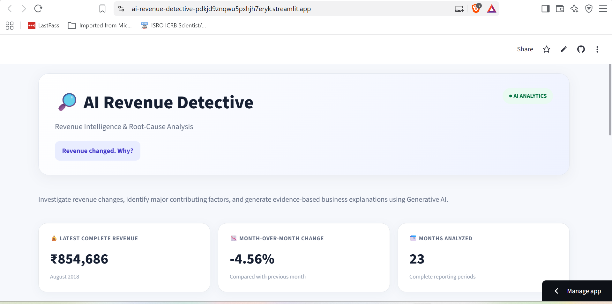
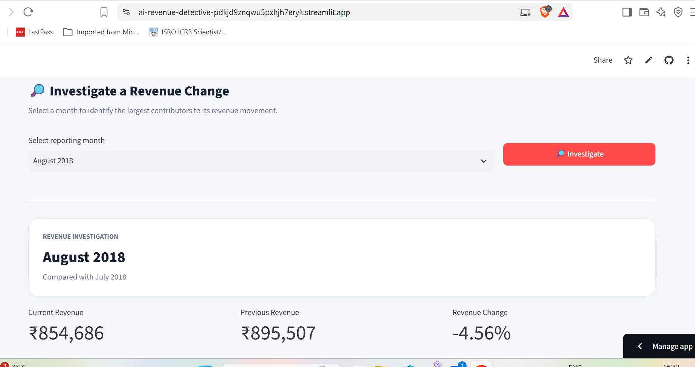
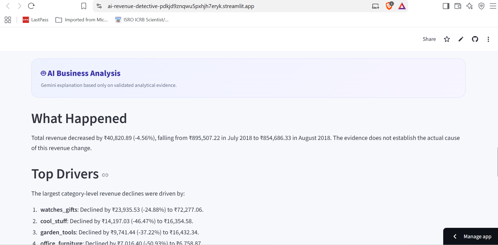

# 🔎 AI Revenue Detective

### Automated Revenue Root-Cause & Business Intelligence System

> **Revenue changed. Why?**

AI Revenue Detective is an interactive business intelligence application that automatically detects revenue changes, identifies the major contributing factors, validates analytical evidence, and uses Generative AI to generate business-oriented explanations.

The project combines **Python, Pandas, data analytics, root-cause analysis, Gemini API, Plotly, and Streamlit** to create an end-to-end revenue investigation system.

---

## 🚀 Live Demo

### [🔎 Launch AI Revenue Detective](https://ai-revenue-detective-pdkjd9znqwu5pxhjh7eryk.streamlit.app/)

## 💻 Source Code

### [GitHub Repository](https://github.com/nilofersyed/AI-Revenue-Detective)

---

# 📌 Project Overview

Revenue dashboards usually answer:

> **What happened?**

But business teams also need to understand:

> **Why did it happen?**

AI Revenue Detective was designed to automate this investigation.

The application analyzes historical e-commerce revenue, detects month-over-month changes, investigates the underlying drivers across multiple business dimensions, validates the findings, and uses Generative AI to explain the results.

### Core Principle

> **Analytics determines the facts. AI explains the facts.**

The LLM does not independently analyze the raw dataset and make numerical assumptions.

Python performs the quantitative analysis first. Only validated analytical evidence is provided to Gemini for explanation.

---

# 📸 Dashboard Preview

## 1. Revenue Intelligence Dashboard

The main dashboard provides a high-level view of revenue performance, monthly movement, and complete reporting periods.



---

## 2. Revenue Investigation

Users can select a reporting month and investigate its revenue movement compared with the previous period.

The application provides current revenue, previous revenue, percentage change, and the major contributing drivers.



---

## 3. AI Business Analysis

After the quantitative investigation, validated analytical evidence is passed to Gemini to generate a business-oriented explanation.



---

# 🎯 Business Problem

Unexpected revenue changes can require significant manual investigation.

A business analyst may need to determine:

- When did revenue change?
- How significant was the change?
- Which product categories contributed?
- Which sellers were affected?
- Which states contributed?
- What were the largest revenue drivers?
- How can the findings be communicated clearly?

AI Revenue Detective brings these analytical steps into a single workflow.

---

# 💡 Solution

The system follows a structured **evidence-first analytical pipeline**:

```mermaid
flowchart TD
    A["Olist E-Commerce Dataset"]
    B["Data Preparation<br/>Python / Pandas"]
    C["Revenue & KPI Analysis"]
    D["Change Detection<br/>Month-over-Month Analysis"]
    E["Root-Cause Analysis<br/>Category / State / Seller"]
    F["Evidence Validation"]
    G["Gemini AI<br/>Business Explanation"]
    H["Interactive Streamlit Application"]

    A --> B
    B --> C
    C --> D
    D --> E
    E --> F
    F --> G
    G --> H
